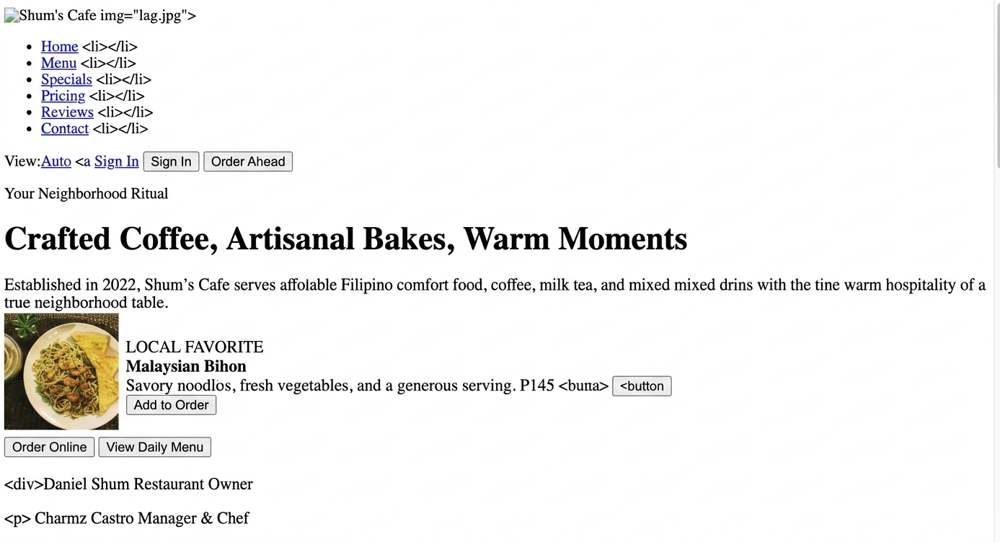
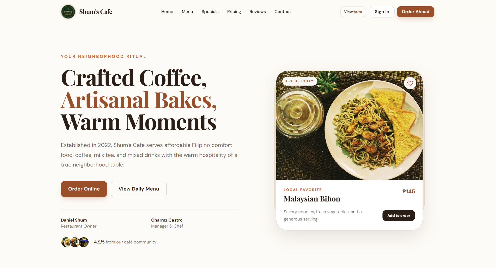
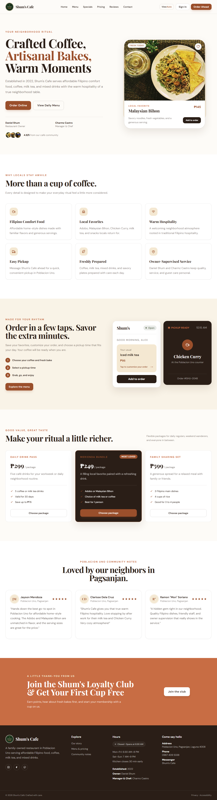
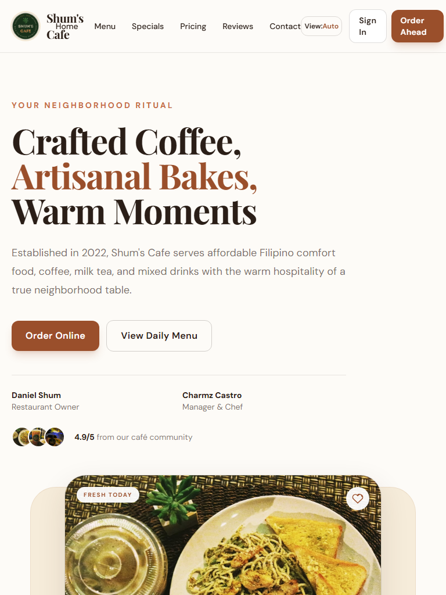
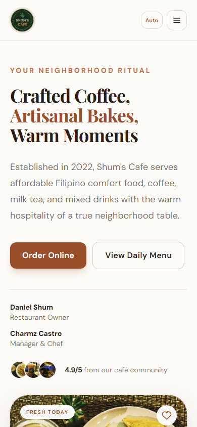
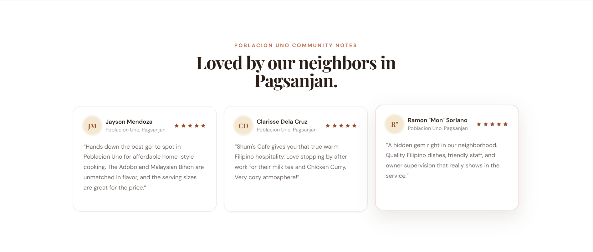
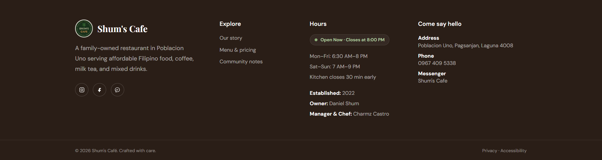

# Shum's Cafe Landing Page

## Introduction

This project is a responsive product landing page for **Shum's Cafe**, a family-owned cafe in Poblacion Uno, Pagsanjan. The page presents the cafe story, Filipino comfort food, coffee and milk tea offerings, ordering preview, customer reviews, loyalty CTA, and contact details in one focused experience.

### What Is a Product Landing Page?

A product landing page is a focused webpage designed to guide visitors toward a primary action such as ordering, viewing a menu, signing up, or contacting a business. This project uses a clear visual hierarchy and direct calls to action so visitors can understand the cafe offering quickly on any device.

### Why Landing Pages Matter

- **Higher conversion potential:** focused content reduces distractions and makes CTAs easier to find.
- **Targeted communication:** the page speaks directly to nearby cafe customers and regulars.
- **Measurable interaction:** buttons, ordering controls, view modes, and status components create clear interaction points.

## Project Objectives

- Build a mobile-first interface with Laravel Blade and Tailwind CSS.
- Use reusable Blade components for navigation, buttons, cards, hero content, and footer content.
- Support desktop, tablet, and mobile layouts without horizontal overflow.
- Apply accessible labels, focus states, escaped dynamic text, and useful image alt text.
- Add Alpine.js interactions for ordering customization, favorites, cart feedback, store status, and pickup status.
- Document the iterative transition from a basic wireframe to a polished cafe landing page.

## Technology Stack

- Laravel 11 application structure
- Blade templates and Blade components
- Tailwind CSS via CDN configuration in the base layout
- Alpine.js via CDN for lightweight interactivity
- Google Fonts: Playfair Display and DM Sans
- Local image assets in `public/images/`

## Responsive Web Design

The interface is mobile-first. Base classes support small screens, then Tailwind prefixes progressively enhance the layout.

- **Mobile:** stacked sections, compact navigation, single-column cards, smaller headings, and reduced vertical spacing.
- **Tablet:** wider content area, two-column feature and ordering layouts where space permits, and contained card widths.
- **Desktop:** split hero, expanded navigation, multi-column features, pricing, reviews, and footer layout.
- **Flexbox:** used for navigation, CTA groups, card metadata, and the loyalty section.
- **CSS Grid:** used for feature cards, pricing cards, ordering previews, testimonials, and footer columns.
- **Overflow safety:** the page shell uses `min-w-0` and `overflow-x-hidden`; large headings use `break-words` to prevent mobile spillover.

Recommended test sizes:

| View | Width | Height |
|---|---:|---:|
| Desktop | 1440px | 900px |
| Tablet | 768px | 1024px |
| Mobile | 390px | 844px |

## Tailwind CSS Implementation

Tailwind utilities are used directly in the Blade templates. The shared palette is defined in `resources/views/layouts/app.blade.php`.

```html
<div class="grid gap-5 md:grid-cols-2 lg:grid-cols-3">
    <x-feature-card
        title="Filipino Comfort Food"
        description="Affordable home-style dishes made with familiar flavors."
        icon="coffee"
    />
</div>
```

The hero uses a mobile-first single column and becomes a desktop split:

```html
<div class="grid gap-8 sm:gap-12 lg:grid-cols-[1fr_0.9fr]">
    <!-- cafe copy and interactive food card -->
</div>
```

## Blade Components Architecture

`resources/views/pages/landing.blade.php` composes the page, while reusable UI patterns live in `resources/views/components/`.

- `x-navbar`: responsive navigation, mobile menu, and Auto/Desktop/Tablet/Mobile preview switcher.
- `x-button`: shared CTA variants, sizes, hover states, focus rings, and active press states.
- `x-hero`: cafe introduction and interactive food card with favorite and add-to-order controls.
- `x-feature-card`: repeatable cafe value proposition cards.
- `x-quick-reorder-card`: Alpine-powered item, sugar, ice, side, price, and cart customization preview.
- `x-live-order-status-card`: pickup status modal with simulated status changes.
- `x-pricing-card`: reusable package offer cards.
- `x-testimonial-card`: escaped review output and initials-based user avatars.
- `x-footer`: grouped contact details, operating hours, social links, and store status badge.

This structure keeps page composition readable and makes repeated UI behavior easier to maintain.

## Interactive Features

### Live Order Preview

The order preview updates without a page refresh. Visitors can change the menu item, sugar level, ice level, side dish, calculated total, cart count, and confirmation state.

### Dynamic Store Status

The footer uses the browser time and weekday to display an open or closed badge. Weekday hours are 6:30 AM to 8:00 PM, while weekend hours are 7:00 AM to 9:00 PM. The badge refreshes every minute.

### Pickup Status Simulation

The order status widget cycles through Preparing, Ready, and Picked Up. The current simulation can later be replaced with a Laravel Reverb event listener without redesigning the component.

## UI/UX Design Principles

- **Color palette:** espresso, crema, oat, amber, terracotta, and sage create a warm cafe identity.
- **Typography:** Playfair Display gives headings an editorial character; DM Sans supports readable interface copy.
- **Contrast:** primary text uses espresso, while status and CTA colors are reserved for meaningful actions.
- **Buttons:** CTAs include hover lift, active press scaling, keyboard focus rings, and clear labels.
- **Cards:** restrained borders, soft shadows, rounded corners, and consistent internal padding create visual grouping without clutter.
- **Accessibility:** semantic headings, descriptive labels, escaped Blade output, focus-visible states, and image alt text are included throughout the page.

## Folder Structure

```text
week05-product-landing-page/
├── README.md
├── app/
├── public/
│   └── images/
├── routes/
│   └── web.php
├── resources/
│   ├── css/
│   │   └── app.css
│   ├── js/
│   │   └── app.js
│   └── views/
│       ├── components/
│       │   ├── button.blade.php
│       │   ├── feature-card.blade.php
│       │   ├── footer.blade.php
│       │   ├── hero.blade.php
│       │   ├── live-order-status-card.blade.php
│       │   ├── navbar.blade.php
│       │   ├── pricing-card.blade.php
│       │   ├── quick-reorder-card.blade.php
│       │   └── testimonial-card.blade.php
│       ├── layouts/
│       │   └── app.blade.php
│       └── pages/
│           └── landing.blade.php
└── tests/
```

## Screenshots

The responsive preview assets are real captures from the running Laravel website. They show the first viewport only so the README stays compact and easy to scan.

<div align="center">

<table>
<tr>
<td align="center"></td>
<td align="center"></td>
</tr>
<tr>
<td align="center"><strong>Before</strong></td>
<td align="center"><strong>After</strong></td>
</tr>
<tr>
<td align="center"></td>
<td align="center"></td>
</tr>
<tr>
<td align="center"><strong>Desktop Layout</strong></td>
<td align="center"><strong>Tablet Layout</strong></td>
</tr>
<tr>
<td align="center"></td>
<td align="center"></td>
</tr>
<tr>
<td align="center"><strong>Mobile Layout</strong></td>
<td align="center"><strong>Header</strong></td>
</tr>
<tr>
<td align="center"></td>
<td align="center"></td>
</tr>
<tr>
<td align="center"><strong>Pricing Cards</strong></td>
<td align="center"><strong>Testimonials</strong></td>
</tr>
<tr>
<td align="center"></td>
<td align="center"></td>
</tr>
<tr>
<td align="center"><strong>Footer</strong></td>
<td align="center"><strong>GitHub Repository</strong></td>
</tr>
<tr>
<td align="center"></td>
<td align="center"></td>
</tr>
<tr>
<td align="center"><strong>VS Code Project Structure</strong></td>
<td align="center"><strong>Blade Components Folder</strong></td>
</tr>
</table>

</div>

## Before-and-After Evolution

| Phase | Description |
|---|---|
| Before | Basic landing page structure focused on content placement and section order. |
| Iteration | Added reusable Blade components, responsive grids, warm cafe branding, local imagery, and clearer CTA hierarchy. |
| After | Added responsive safeguards, interactive Alpine previews, dynamic store status, status simulation, accessible states, and polished visual rhythm. |

## Local Setup

```bash
composer install
copy .env.example .env
php artisan key:generate
php artisan serve
```

Open `http://127.0.0.1:8000` in a browser.

Useful validation commands:

```bash
php artisan view:cache
php artisan test
```

## Testing Responsive Views

1. Open the local app in Chrome or Edge.
2. Press `Ctrl + Shift + M` to open device emulation.
3. Test 1440 × 900, 768 × 1024, and 390 × 844.
4. Confirm there is no horizontal scroll, text does not overlap, cards stay inside the viewport, and mobile navigation opens correctly.
5. Use the navbar **View** control to cycle through Auto, Desktop, Tablet, and Mobile preview shells.

